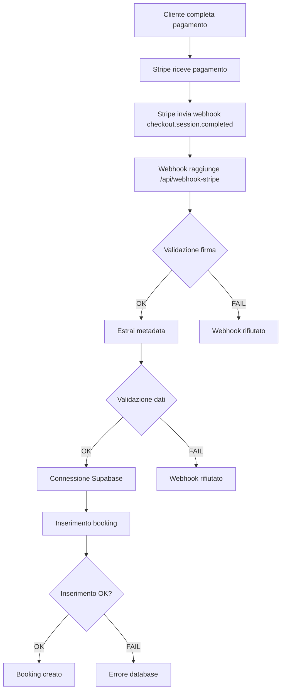

# Analisi Problema Pagamento - Lorenzo Forcignano (69€)

## Situazione
- **Cliente**: Lorenzo Forcignano
- **Importo**: 69€ (ricevuto su Stripe)
- **Problema**: Pagamento non registrato nel database WeShoot
- **Gravità**: CRITICA - Perdita di ricavi

## Possibili Cause

### 1. **Webhook Stripe Non Processato**
- Il webhook `checkout.session.completed` potrebbe non essere stato ricevuto
- Errore nella validazione della firma del webhook
- Timeout del webhook (max 30 secondi su Vercel)
- Rate limiting del webhook

### 2. **Errore nel Database**
- Connessione Supabase fallita durante l'inserimento
- Violazione di constraint (RLS, foreign key, etc.)
- Errore nella validazione dei dati
- Problema con il Service Role Key

### 3. **Dati Metadata Mancanti**
- `userId`, `tourId`, `sessionId` mancanti nei metadata di Stripe
- Validazione fallita per dati non validi
- Utente anonimo (non più supportato)

### 4. **Problema di Concorrenza**
- Doppio processing dello stesso webhook
- Race condition nell'inserimento

## Flusso di Pagamento Analizzato



## Punti di Fallimento Identificati

### 1. **Webhook Endpoint** (`/api/webhook-stripe/route.ts`)
- **Linea 34-38**: Validazione firma webhook
- **Linea 83-90**: Validazione dati metadata
- **Linea 99-106**: Controllo campi obbligatori
- **Linea 131-158**: Inserimento booking nel database

### 2. **Rate Limiting**
- Il webhook ha rate limiting applicato
- Potrebbe bloccare richieste legittime

### 3. **Timeout Vercel**
- Max 30 secondi per l'esecuzione
- Se il webhook impiega più tempo, viene terminato

## Soluzioni Immediate

### 1. **Investigazione**
```bash
# Esegui lo script di debug
node debug-payment-issue.js
```

### 2. **Recupero Pagamento**
```bash
# Trova automaticamente pagamenti mancanti
node fix-missing-payment.js

# Recupera pagamento specifico
node fix-missing-payment.js <paymentId> <userId> <tourId> <sessionId>
```

### 3. **Verifica Log**
- Controlla i log di Vercel per errori webhook
- Verifica i log di Supabase per errori database
- Controlla i log di Stripe per webhook falliti

## Prevenzione Futura

### 1. **Monitoring**
- Aggiungere logging dettagliato nei webhook
- Monitorare i webhook falliti
- Alert per pagamenti non processati

### 2. **Retry Mechanism**
- Implementare retry automatico per webhook falliti
- Queue per riprocessare pagamenti mancanti

### 3. **Reconciliation**
- Script giornaliero per verificare pagamenti Stripe vs database
- Alert automatici per discrepanze

## Azioni Immediate Richieste

1. **Esegui lo script di debug** per identificare il pagamento specifico
2. **Recupera il pagamento** usando lo script di fix
3. **Verifica i log** per capire la causa root
4. **Implementa monitoring** per prevenire futuri problemi

## Contatti Stripe

Se necessario, contatta il supporto Stripe con:
- Payment Intent ID
- Session ID
- Timestamp del pagamento
- Log degli errori webhook
