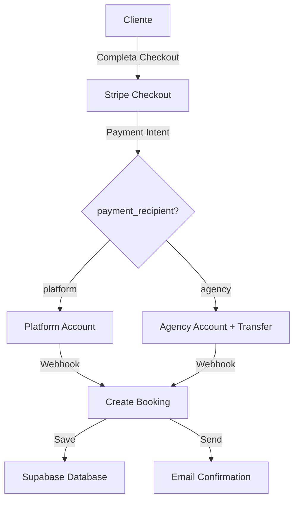

# Stripe Connect - Riferimento Tecnico

Questo documento fornisce i dettagli tecnici dell'implementazione per sviluppatori.

## Architettura

### Modello Stripe Connect
**Destination Charges** con opzionale Application Fee

- **Platform Account**: Account principale che gestisce tutti i checkout
- **Connected Account**: Account dell'agenzia che riceve trasferimenti automatici

### Flusso di Pagamento



## Schema Database

### Modifica Tour (Strapi CMS)

```sql
-- Aggiunto al Content Type "Tour" in Strapi
ALTER TABLE tours 
ADD COLUMN payment_recipient VARCHAR(20) DEFAULT 'agency' 
CHECK (payment_recipient IN ('platform', 'agency'));
```

### Nessuna Modifica a Supabase
Non servono modifiche al database Supabase. Il campo `payment_recipient` viene salvato nei metadata della booking.

## Modifiche al Codice

### 1. Type Definitions

**File**: `src/types/tour.ts`

```typescript
export interface Tour {
  // ... campi esistenti
  payment_recipient?: 'weshoot' | 'agency';
}
```

### 2. GraphQL Queries

**File**: `src/graphql/queries/tour-base.ts`

```graphql
fragment TourBaseFields on Tour {
  # ... campi esistenti
  payment_recipient
}
```

**File**: `src/scripts/snapshot.mjs`

```graphql
query Tours {
  tours {
    # ... campi esistenti
    payment_recipient
  }
}
```

### 3. Payment API

**File**: `src/app/api/stripe/create-checkout-session/route.ts`

#### Funzione Helper
```typescript
const GET_TOUR_PAYMENT_RECIPIENT = gql`
  query GetTourPaymentRecipient($id: ID!) {
    tour(id: $id) {
      id
      payment_recipient
    }
  }
`

async function getTourPaymentRecipient(tourId: string): Promise<'weshoot' | 'agency'> {
  const client = getClient()
  const data = await client.request(GET_TOUR_PAYMENT_RECIPIENT, { id: tourId })
  return data.tour?.payment_recipient || 'agency'
}
```

#### Logica di Routing
```typescript
// Fetch payment recipient
const paymentRecipient = await getTourPaymentRecipient(tourId)

// Base session params
const sessionParams: Stripe.Checkout.SessionCreateParams = {
  // ... parametri standard
  metadata: {
    // ... metadata esistenti
    paymentRecipient,
  },
}

// Add Connect params for agency payments
if (paymentRecipient === 'agency') {
  const agencyAccountId = process.env.STRIPE_CONNECT_AGENCY_ACCOUNT_ID
  const platformFeePercent = parseFloat(process.env.STRIPE_PLATFORM_FEE_PERCENT || '0')
  const platformFeeAmount = platformFeePercent > 0 
    ? Math.round(finalAmount * (platformFeePercent / 100))
    : 0
  
  sessionParams.payment_intent_data = {
    on_behalf_of: agencyAccountId,
    transfer_data: {
      destination: agencyAccountId,
    },
    ...(platformFeeAmount > 0 && {
      application_fee_amount: platformFeeAmount,
    }),
  }
}

const checkoutSession = await stripe.checkout.sessions.create(sessionParams)
```

## Environment Variables

### Variabili Richieste

```bash
# Stripe Platform (già esistente)
STRIPE_SECRET_KEY=sk_live_xxx                     # O sk_test_xxx per test
STRIPE_WEBHOOK_SECRET=whsec_xxx

# Stripe Connect (nuovo)
STRIPE_CONNECT_AGENCY_ACCOUNT_ID=acct_xxx         # Account ID dell'agenzia
STRIPE_PLATFORM_FEE_PERCENT=0                     # Percentuale fee (0-100)
```

### Validazione

```typescript
// In create-checkout-session/route.ts
if (paymentRecipient === 'agency') {
  if (!process.env.STRIPE_CONNECT_AGENCY_ACCOUNT_ID) {
    throw new Error('STRIPE_CONNECT_AGENCY_ACCOUNT_ID not configured')
  }
}
```

## Stripe API Calls

### Checkout Session - WeShoot

```typescript
const session = await stripe.checkout.sessions.create({
  payment_method_types: ['card', 'klarna', 'sepa_debit'],
  line_items: [...],
  mode: 'payment',
  // Nessun parametro aggiuntivo per WeShoot
})
```

### Checkout Session - Agency (con Connect)

```typescript
const session = await stripe.checkout.sessions.create({
  payment_method_types: ['card', 'klarna', 'sepa_debit'],
  line_items: [...],
  mode: 'payment',
  // Parametri Connect
  payment_intent_data: {
    on_behalf_of: 'acct_xxx',           // Agency account
    transfer_data: {
      destination: 'acct_xxx',          // Agency account
    },
    application_fee_amount: 250,        // Optional fee in cents (2.50€ in questo caso)
  },
})
```

## Webhook Handling

### Nessuna Modifica Richiesta

Il webhook esistente in `src/app/api/webhook-stripe/route.ts` continua a funzionare senza modifiche.

Il campo `paymentRecipient` è disponibile nei metadata:

```typescript
// In webhook handler
const session = event.data.object as Stripe.Checkout.Session
const paymentRecipient = session.metadata?.paymentRecipient // 'platform' | 'agency'
```

## Testing

### Test Cards

```typescript
// Successo (no 3DS)
const TEST_CARD_SUCCESS = '4242424242424242'

// Successo (richiede 3DS)
const TEST_CARD_3DS = '4000002500003155'

// Declined
const TEST_CARD_DECLINED = '4000000000000002'

// Insufficient funds
const TEST_CARD_NO_FUNDS = '4000000000009995'
```

### Verificare il Routing

```typescript
// Nei log del server dovresti vedere:
console.log('💳 [CHECKOUT] Payment recipient for tour xxx: weshoot')
// oppure
console.log('🏢 [CHECKOUT] Routing to agency account: acct_xxx')
console.log('💰 [CHECKOUT] Platform fee: 2.50€ (2.5%)')
```

### Verificare nella Stripe Dashboard

**WeShoot Payment:**
- Dashboard → Payments → Dettaglio pagamento
- ❌ Non deve avere `Connected account`
- ❌ Non deve avere `Transfer`

**Agency Payment:**
- Dashboard → Payments → Dettaglio pagamento
- ✅ Deve avere `Connected account: acct_xxx`
- ✅ Deve avere `Transfer: €X.XX`
- ✅ Se configurata, `Application fee: €X.XX`

## Calcolo Commissioni

### Esempio: Pagamento 100€ all'agenzia

```typescript
const amount = 10000 // 100€ in cents
const platformFeePercent = 2.5
const platformFeeAmount = Math.round(amount * (platformFeePercent / 100))
// platformFeeAmount = 250 (2.50€)

// Cliente paga: 100.00€
// Stripe trattiene: ~1.75€ (1.5% + 0.25€)
// Platform fee: 2.50€
// Agenzia riceve: 95.75€ (dopo Stripe fees e platform fee)
```

### Chi Paga Cosa

| Entità | Importo | Note |
|--------|---------|------|
| Cliente | 100.00€ | Importo totale |
| Stripe | ~1.75€ | Commissioni Stripe (pagate dall'agenzia) |
| Platform (tu) | 2.50€ | Application fee (se configurata) |
| Agenzia | ~95.75€ | Importo netto ricevuto |

## API Reference

### Stripe Payment Intent Data

```typescript
interface PaymentIntentData {
  on_behalf_of: string;              // Connected account ID
  transfer_data: {
    destination: string;             // Connected account ID
  };
  application_fee_amount?: number;   // Optional fee in cents
}
```

### Session Metadata

```typescript
interface SessionMetadata {
  userId: string;
  tourId: string;
  sessionId: string;
  paymentType: 'deposit' | 'balance' | 'full';
  quantity: string;
  paymentRecipient: 'weshoot' | 'agency';  // Nuovo campo
  // ... altri campi
}
```

## Security Considerations

### ✅ Best Practices Implementate

1. **Server-side routing**: Il client non sa quale account riceve i soldi
2. **CMS-based configuration**: Il payment_recipient viene dal CMS, non dal client
3. **Environment variables**: Account ID protetti in variabili d'ambiente
4. **Webhook verification**: Firma verificata per ogni evento
5. **Metadata tracking**: Tracciamento completo di ogni pagamento

### ⚠️ Attenzioni

1. **Non esporre mai** l'account ID dell'agenzia nel frontend
2. **Non permettere** al client di scegliere il payment_recipient
3. **Validare sempre** che l'account Connect sia valido prima di creare la sessione
4. **Monitorare** i log per eventuali tentativi di manipolazione

## Monitoring & Logging

### Log Patterns

```bash
# Startup
💳 [CHECKOUT] Payment recipient for tour 123: agency
🏢 [CHECKOUT] Routing to agency account: acct_xxx
💰 [CHECKOUT] Platform fee: 2.50€ (2.5%)

# Success
✅ [CHECKOUT] Checkout session created: cs_xxx

# Error
❌ [CHECKOUT] STRIPE_CONNECT_AGENCY_ACCOUNT_ID not configured
```

### Metrics to Track

- Numero di pagamenti platform vs agency
- Application fees totali
- Tasso di successo per tipo di account
- Latenza API per routing Connect

## Troubleshooting

### Debug Checklist

```typescript
// 1. Verificare variabili d'ambiente
console.log('Agency Account ID:', process.env.STRIPE_CONNECT_AGENCY_ACCOUNT_ID)
console.log('Platform Fee %:', process.env.STRIPE_PLATFORM_FEE_PERCENT)

// 2. Verificare payment_recipient dal CMS
const recipient = await getTourPaymentRecipient(tourId)
console.log('Tour payment recipient:', recipient)

// 3. Verificare session params
console.log('Session params:', JSON.stringify(sessionParams, null, 2))

// 4. Verificare webhook metadata
console.log('Webhook metadata:', session.metadata)
```

### Common Issues

| Issue | Causa | Fix |
|-------|-------|-----|
| `STRIPE_CONNECT_AGENCY_ACCOUNT_ID not configured` | Env var mancante | Aggiungi in .env.local e Vercel |
| Transfer non appare | `payment_intent_data` mancante | Verifica logica in create-checkout-session |
| Fee non corretta | Calcolo sbagliato | Verifica `Math.round(amount * percent / 100)` |
| Account non trovato | Account ID sbagliato | Verifica su Stripe Dashboard → Connect |

## Scalability

### Supporto Multi-Agency

Per supportare più agenzie:

```typescript
// 1. Cambia il tipo
type PaymentRecipient = 'weshoot' | 'agency1' | 'agency2' | 'agency3'

// 2. Mappa gli account
const AGENCY_ACCOUNTS: Record<string, string> = {
  'agency1': process.env.STRIPE_CONNECT_AGENCY1_ACCOUNT_ID,
  'agency2': process.env.STRIPE_CONNECT_AGENCY2_ACCOUNT_ID,
  'agency3': process.env.STRIPE_CONNECT_AGENCY3_ACCOUNT_ID,
}

// 3. Usa la mappa
if (paymentRecipient !== 'weshoot') {
  const agencyAccountId = AGENCY_ACCOUNTS[paymentRecipient]
  // ... resto della logica
}
```

## Performance

### Impatto

- **Latency aggiuntiva**: ~50-100ms per query GraphQL del payment_recipient
- **Stripe API calls**: Stesso numero di chiamate (nessun overhead)
- **Database queries**: Nessuna query aggiuntiva al database Supabase

### Ottimizzazioni Possibili

```typescript
// Cache payment_recipient per sessione utente
const cache = new Map<string, 'weshoot' | 'agency'>()

async function getTourPaymentRecipient(tourId: string) {
  if (cache.has(tourId)) {
    return cache.get(tourId)!
  }
  const recipient = await fetchFromCMS(tourId)
  cache.set(tourId, recipient)
  return recipient
}
```

## Migration Path

Se in futuro vuoi spostare tour da un account all'altro:

1. Cambia `payment_recipient` nel CMS
2. I pagamenti futuri useranno il nuovo account
3. I pagamenti passati restano sull'account originale
4. Nessun impatto sulla cronologia

## Resources

- [Stripe Connect Docs](https://stripe.com/docs/connect)
- [Destination Charges](https://stripe.com/docs/connect/destination-charges)
- [Application Fees](https://stripe.com/docs/connect/direct-charges#collecting-fees)
- [Testing Connect](https://stripe.com/docs/connect/testing)

## Version History

- **v1.0** (2025-11-23): Implementazione iniziale con supporto platform/agency

